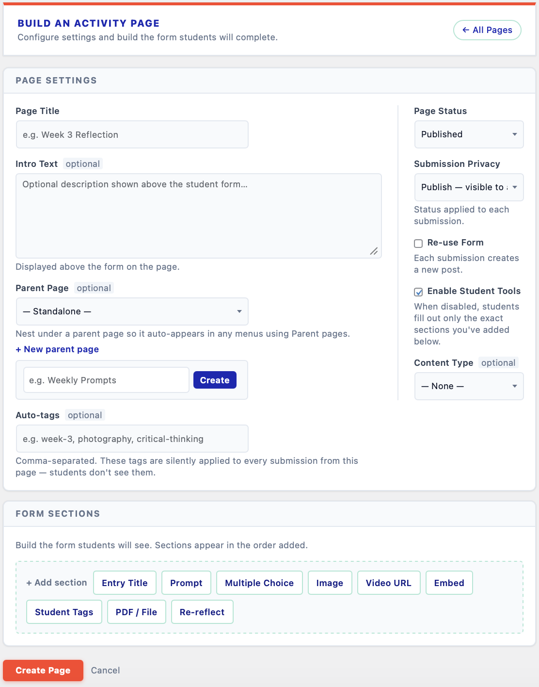
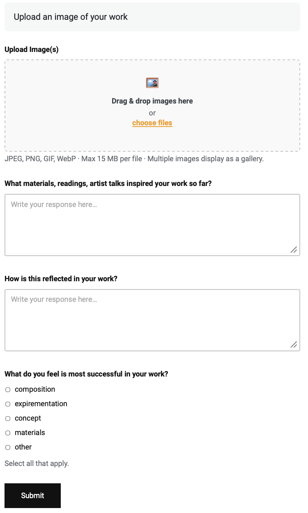

# Activity Builder

A WordPress plugin for structured activities and reflection in higher-education ePortfolios.

The hope is to make it easier for both students and instructors to use WordPress as an ePortfolio platform.

Instructors build activity and reflection prompt pages using a section-based visual builder. Students complete and submit responses directly on the page via easy-to-use forms or the plugin’s custom post builder.

**Instructor view** — building an activity page in the WordPress admin: page settings and form sections on a single screen.

**Student view** — the response form as students see it: image upload, written prompts, and multiple choice.

---

## Requirements

- WordPress 6.0+
- PHP 8.0+
- No additional plugins required

---

## Installation

1. Download the latest release zip from the [Releases](../../releases) page.
2. In your WordPress admin go to **Plugins → Add New → Upload Plugin**.
3. Upload the zip and activate.

---

## Features

### For Instructors
- **Section-based page builder** — compose reflection pages from typed sections: text prompts, multiple-choice questions, PDF embeds, video/image upload fields, and re-reflect cards.
- **Re-reflect section** — automatically surfaces a student's past submission (filtered by date range and tags) to prompt deeper reflection.
- **Submission management** — browse, filter, and read all student submissions per reflection page.
- **Feedback** — leave written feedback on individual submissions; students see it on their My Submissions page.
- **Progress grid** — at-a-glance view of which students have completed which tasks.

### For Students
- Rich text responses, image uploads, PDF attachments, video URLs, and embedded content — all configurable per section.
- **Save as Draft** — save unfinished work to the site and come back to it on another day or another device. Drafts stay invisible to the instructor until submitted.
- Autosave draft (localStorage) with restore notice on reload, as a second safety net.
- **Auto-growing response fields** with a live word count, so long-form writing isn't cramped into a fixed box.
- Friendly client-side file size guard before submission.

---

## Usage

### Page Builder

In the WordPress admin, go to **Activity Builder → Activity Pages** and click **+ New Activity Page**. Add and reorder sections, set the page options in the sidebar, and save. The plugin creates a matching WordPress page with the `[reflection_form]` shortcode already in place, so the form appears for students as soon as you publish.

---

## License

Activity Builder, Copyright (C) 2026 Nikolai Gauer. Licensed under the GNU General Public License v2 or later. See LICENSE or https://www.gnu.org/licenses/gpl-2.0.html
